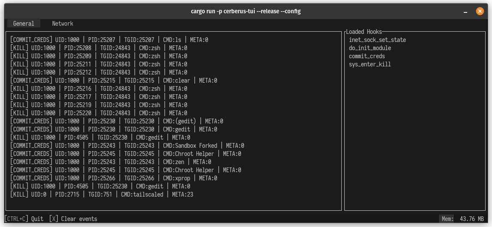
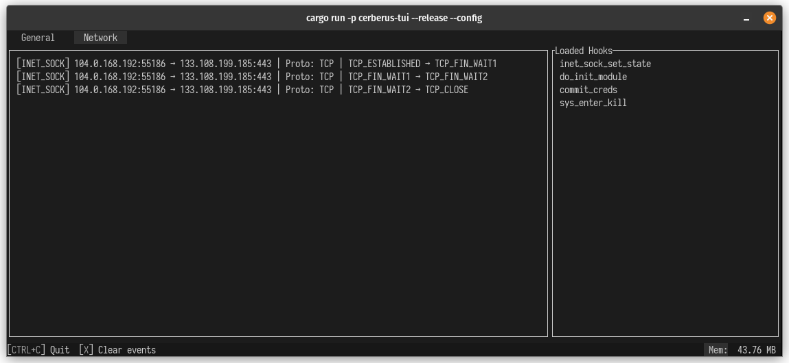
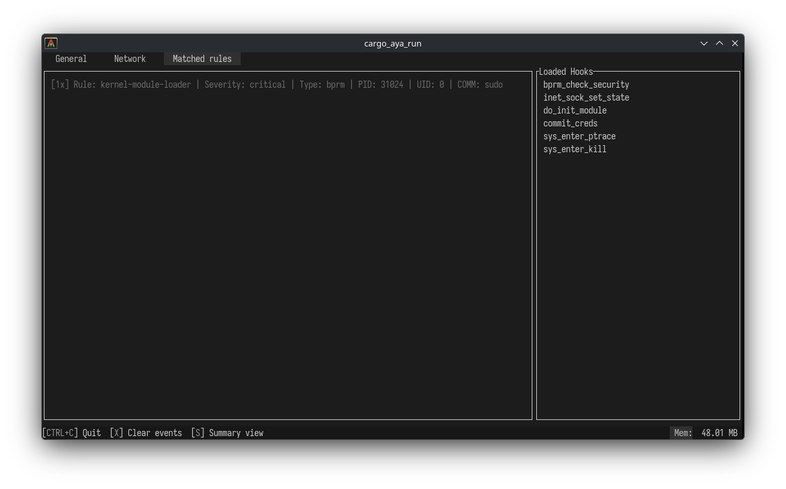
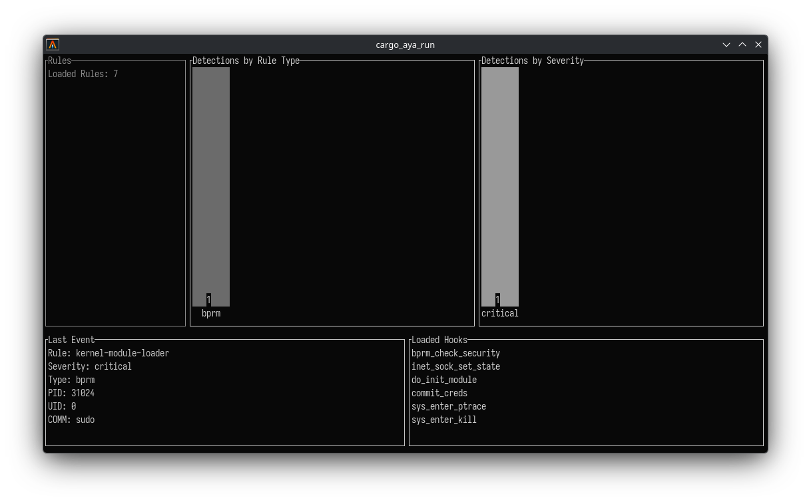

# Cerberus






## Prerequisites

1. stable rust toolchains: `rustup toolchain install stable`
1. nightly rust toolchains: `rustup toolchain install nightly --component rust-src`
1. (if cross-compiling) rustup target: `rustup target add ${ARCH}-unknown-linux-musl`
1. (if cross-compiling) LLVM: (e.g.) `brew install llvm` (on macOS)
1. (if cross-compiling) C toolchain: (e.g.) [`brew install filosottile/musl-cross/musl-cross`](https://github.com/FiloSottile/homebrew-musl-cross) (on macOS)
1. bpf-linker: `cargo install bpf-linker` (`--no-default-features` on macOS)
1. libbpf-devel (Package manager)

## Build & Run

Use `cargo build`, `cargo check`, etc. as normal. Run your program with:

TUI version:

```shell
cargo run -p cerberus --release --config 'target."cfg(all())".runner="sudo -E"' -- --mode tui --rules path/to/rule/dir
```

Agent version:

```shell
# timed run
cargo run -p cerberus --release --config 'target."cfg(all())".runner="sudo -E"' -- --mode agent --rules path/to/rule/dir --time <time in humantime format e.g 5s>

# normal run
cargo run -p cerberus --release --config 'target."cfg(all())".runner="sudo -E"' -- --mode agent --rules path/to/rule/dir

# example
cargo run -p cerberus --release --config 'target."cfg(all())".runner="sudo -E"' -- --mode agent --rules path/to/rule/dir --time 2m
```

Cargo build scripts are used to automatically build the eBPF correctly and include it in the
program.

## Cross-compiling on macOS

Cross compilation should work on both Intel and Apple Silicon Macs.

```shell
CC=${ARCH}-linux-musl-gcc cargo build --package cerberus --release \
  --target=${ARCH}-unknown-linux-musl \
  --config=target.${ARCH}-unknown-linux-musl.linker=\"${ARCH}-linux-musl-gcc\"
```

The cross-compiled program `target/${ARCH}-unknown-linux-musl/release/cerberus` can be
copied to a Linux server or VM and run there.

If tracefs is not mounted automatically, it must be done manually with:

```shell
sudo mount -t tracefs tracefs /sys/kernel/tracing
```

## Development

### Prerequisites

1. All prerequisites from the top of the readme
1. bindgen-cli
1. aya-tool (for generating vmlinux)

```shell
cargo install bindgen-cli
cargo install --git https://github.com/aya-rs/aya -- aya-tool
```

## License

With the exception of eBPF code, Cerberus is distributed under the terms
of either the [MIT license] or the [Apache License] (version 2.0), at your
option.

Unless you explicitly state otherwise, any contribution intentionally submitted
for inclusion in this crate by you, as defined in the Apache-2.0 license, shall
be dual licensed as above, without any additional terms or conditions.

### eBPF

All eBPF code is distributed under either the terms of the
[GNU General Public License, Version 2] or the [MIT license], at your
option.

Unless you explicitly state otherwise, any contribution intentionally submitted
for inclusion in this project by you, as defined in the GPL-2 license, shall be
dual licensed as above, without any additional terms or conditions.

[Apache license]: LICENSE-APACHE
[MIT license]: LICENSE-MIT
[GNU General Public License, Version 2]: LICENSE-GPL2
